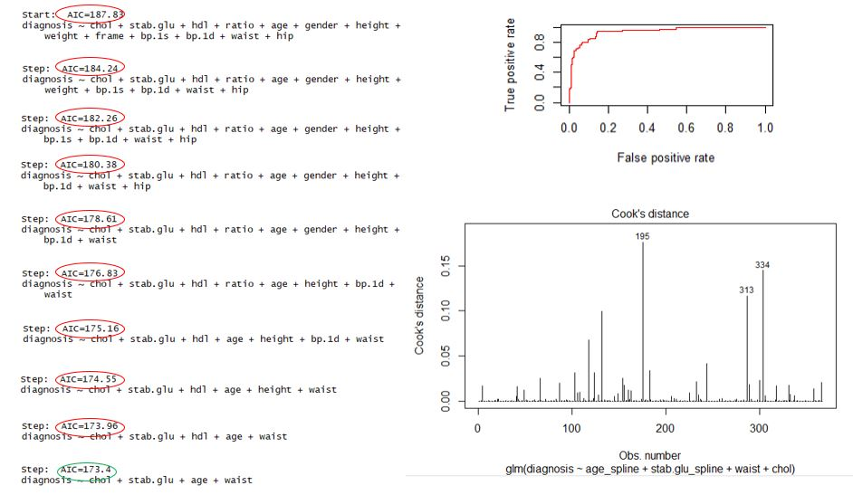

# Portfolio
---
## Diabetes GLM 

The goal  of this project was to build a logistic regression model to explain what factors are related to a positive diabetes diagnosis.

keywords: GLM, Logistic Regression, Spline, StepAIC

---

## South Bend Census Demographics Shiny App

The goal of this project was to use US Census data to develop an App that could be used by South Bend City Officials to easily access census information. This was a group project where each individual contributed a Tab to the App. Only my contribution is linked. 

keywords: Shiny, interactive, dashboard, reactive

---

## Kiva Loan Funding

Kiva is an online platform to extend financial services to poor and financially excluded people around the world through the use of crowdsourced loans. Kiva claims that its lenders have provided over $1 billion dollars in loans to over 2 million people across the world many of whom might have been unable to find loans otherwise. Although most loans are funded, roughly 7% of loans are not fully funded on the platform. In order to fund as many people as possible, it is important to be able to predict which loans will be funded and which loans that will not be fully funded. Overall, I was able to produce a model that predicts if a loan will not be fully funded with an accuracy of  85.6% and sensitivity of 72.9%. While accuracy could be improved it came at a cost of sensitivity. This trade-off was determined to be acceptable because the main objective on the model was to better classify loans that will not be fully funded. With this information, loans applications that are likely not to be funded can be targeted and updated before they ever make it onto the platform. 

keywords: Random Forest, SMOTE, imbalanced data, optimization 

---
## Predicting Extended Absence Time

 Unplanned extended workplace absences can have a detrimental impact on a companies ability to do buisness. This project set out to build a classfication model that would predict when an upplanned absence would last longer than 1 day (8 hours). Predicting when an absence would be extended has the potential to help planning for temorary staff and aid in human resouce management. For this project KNN, glm, decision trees, random forests and SVM models were built, tested and compared. The best performing model was then optmized on sensitivity using SMOTE techniques to balance the data and Monte Carlo simulations to cross-validate. The original model produced a sensitivity of 23% while the optimized model increased sensitivity to 68%.

keywords: KNN, SMOTE, imbalanced data, Monte Carlo, optimization 

---
### Supervised learning techniques for the prediction of malignant and benign tumors of breast tissue masses

 The goal of this project was to use supervised learning techniques to diagnose malignant and benign tumors from fine needle aspiration samples of breast tissue masses. Multiple techniques were used to identify malignant tumors and minimize missclassifications.The Kth Nearest Neighbor technique was found to best classify the data with 95.7% accuracy. A video was made to document the results for an audience of non-technical stakeholders.

keywords: KNN, random forest, bagging, bootstap, decision tree

---

© 2021 Rose Gogliotti. Powered by Jekyll and the Minimal Theme.

