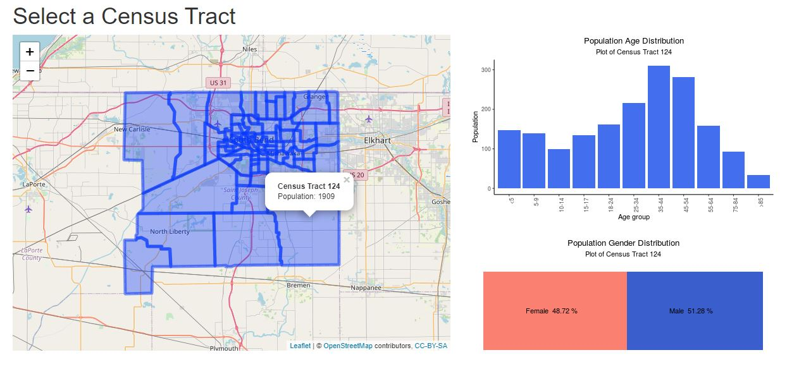
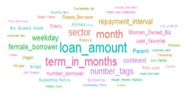
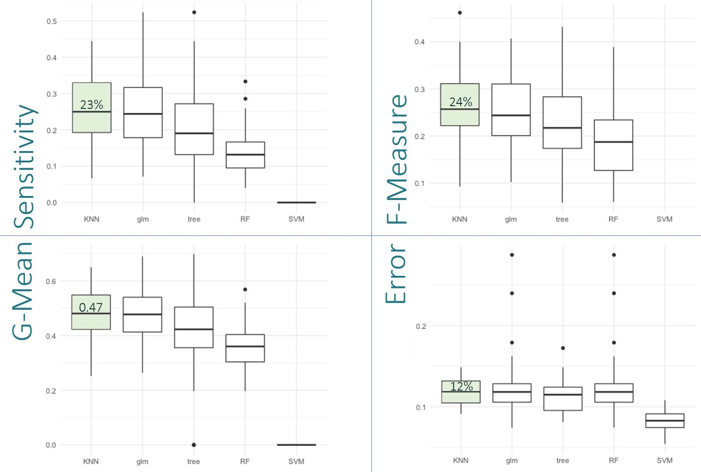
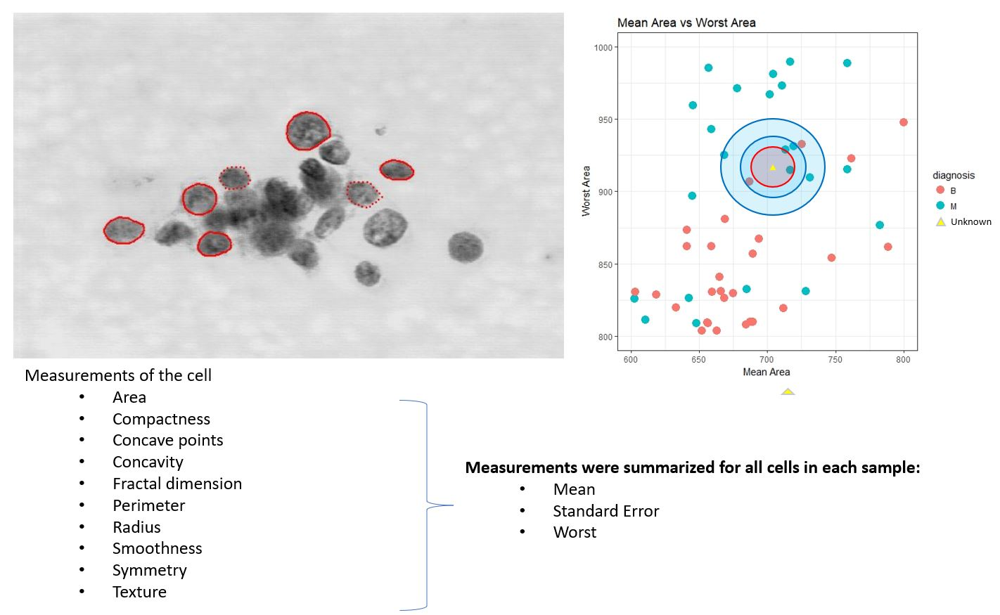

# Portfolio
---
### South Bend Census Demographics Shiny App

The goal of this project was to use US Census data to develop an App that could be used by South Bend City Officials to easily access census information. This was a group project where each individual contributed a Tab to the App. Only my contribution is linked. 

keywords: Shiny, interactive, dashboard, reactive

---

### Kiva Loan Funding

Kiva is an online platform to extend financial services to poor and financially excluded people around the world through the use of crowdsourced loans. Kiva claims that its lenders have provided over $1 billion dollars in loans to over 2 million people across the world many of whom might have been unable to find loans otherwise. Although most loans are funded, roughly 7% of loans are not fully funded on the platform. In order to fund as many people as possible, it is important to be able to predict which loans will be funded and which loans that will not be fully funded. Overall, I was able to produce a model that predicts if a loan will not be fully funded with an accuracy of  85.6% and sensitivity of 72.9%. While accuracy could be improved it came at a cost of sensitivity. This trade-off was determined to be acceptable because the main objective on the model was to better classify loans that will not be fully funded. With this information, loans applications that are likely not to be funded can be targeted and updated before they ever make it onto the platform. 

A project completed as part of my Notre Dame MS Data Science program (https://datascience.nd.edu/programs/)

keywords: Random Forest, SMOTE, imbalanced data, optimization 

---
### Predicting Extended Absence Time

 Unplanned extended workplace absences can have a detrimental impact on a companies ability to do buisness. This project set out to build a classfication model that would predict when an upplanned absence would last longer than 1 day (8 hours). Predicting when an absence would be extended has the potential to help planning for temorary staff and aid in human resouce management. For this project KNN, glm, decision trees, random forests and SVM models were built, tested and compared. The best performing model was then optmized on sensitivity using SMOTE techniques to balance the data and Monte Carlo simulations to cross-validate. The original model produced a sensitivity of 23% while the optimized model increased sensitivity to 68%.

A project completed as part of my Notre Dame MS Data Science program (https://datascience.nd.edu/programs/)

keywords: KNN, SMOTE, imbalanced data, Monte Carlo, optimization 

---
### Supervised learning techniques for the prediction of malignant and benign tumors of breast tissue masses

 The goal of this project was to use supervised learning techniques to diagnose malignant and benign tumors from fine needle aspiration samples of breast tissue masses. Multiple techniques were used to identify malignant tumors and minimize missclassifications.The Kth Nearest Neighbor technique was found to best classify the data with 95.7% accuracy. A video was made to document the results for an audience of non-technical stakeholders.

A project completed as part of my Notre Dame MS Data Science program (https://datascience.nd.edu/programs/)
keywords: KNN, random forest, bagging, bootstap, decision tree

---
### Detect Non-negative Airline Tweets: BERT for Sentiment Analysis

The release of Google's BERT is described as the beginning of a new era in NLP. In this notebook I'll use the HuggingFace's transformers library to fine-tune pretrained BERT model for a classification task. Then I will compare BERT's performance with a baseline model, in which I use a TF-IDF vectorizer and a Naive Bayes classifier. The transformers library helps us quickly and efficiently fine-tune the state-of-the-art BERT model and yield an accuracy rate 10% higher than the baseline model.

---
### Detect Food Trends from Facebook Posts: Co-occurence Matrix, Lift and PPMI

First I build co-occurence matrices of ingredients from Facebook posts from 2011 to 2015. Then, to identify interesting and rare ingredient combinations that occur more than by chance, I calculate Lift and PPMI metrics. Lastly, I plot time-series data of identified trends to validate my findings. Interesting food trends have emerged from this analysis.

 

 

---
### Detect Spam Messages: TF-IDF and Naive Bayes Classifier

In order to predict whether a message is spam, first I vectorized text messages into a format that machine learning algorithms can understand using Bag-of-Word and TF-IDF. Then I trained a machine learning model to learn to discriminate between normal and spam messages. Finally, with the trained model, I classified unlabel messages into normal or spam.

 

 

---
## Data Science

### Credit Risk Prediction Web App

After my team preprocessed a dataset of 10K credit applications and built machine learning models to predict credit default risk, I built an interactive user interface with Streamlit and hosted the web app on Heroku server.

 

 

---
### Kaggle Competition: Predict Ames House Price using Lasso, Ridge, XGBoost and LightGBM

I performed comprehensive EDA to understand important variables, handled missing values, outliers, performed feature engineering, and ensembled machine learning models to predict house prices. My best model had Mean Absolute Error (MAE) of 12293.919, ranking <b>95/15502</b>, approximately <b>top 0.6%</b> in the Kaggle leaderboard.

 

 

---
### Predict Breast Cancer with RF, PCA and SVM using Python

In this project I am going to perform comprehensive EDA on the breast cancer dataset, then transform the data using Principal Components Analysis (PCA) and use Support Vector Machine (SVM) model to predict whether a patient has breast cancer.

 

 

---

---

© 2021 Rose Gogliotti. Powered by Jekyll and the Minimal Theme.

